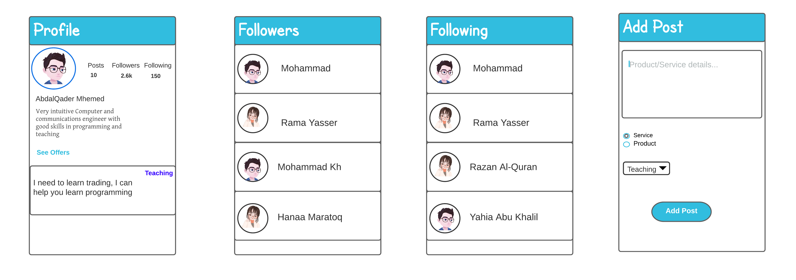

# User Stories 
## Everyone - Project preparation: Download project starting files and setup everything before you go. 
## Create an account : When user click on create an account / sign up button, the user would have his information in the database and he would have his own page 
## Login: As a user, I want to login to my account ,and see my personal info that I have listed.
## Edit profile : When user click on edit, he would be able to edit his personal info 
## As a user I want to be able to contact other users to discus the details of the offer 
## As I user I would like to have the ability to follow other users and see their posts 

trello link:  https://trello.com/b/ZgibHdhW/tabadolandroid

## Domain Modeling 
## Wireframe:

# ER Diagram
## Using a Database

# Software Requirements Vision
https://github.com/TeamCapsLock/tabadol_android/blob/main/requirements.md

